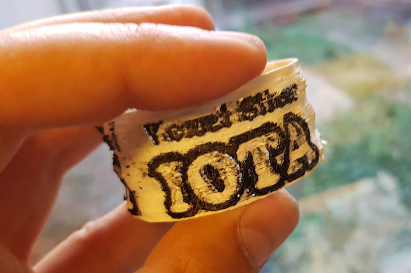

# Iota <!--[ver-->v0.1.1b<!--]--> Voxel based Mesh Slicer for Color 3D Printing #

## Status: compiling and running on all three platforms, first successful prints ##

### Overview ###

Iota is a voxel based slicer that can handle textured meshes for 3d printing. Iota can 
generate image slices for inkjet/powder based machines, GCode files for color FDM/FFF 
printing with multiple extruders and mixing extruders, and DXF files for creating stacked 
models with laser cutters.

Iota will be an easy-to-use system for the colorful future of 3D printing.

First ever Iota generated color printout (XYZPrinting DaVinci Duo, dual extruders)

### Why Voxels ###

Voxels is short for VOlumetrix piXEL, pixels in 3D space. Iota works by converting 3D vector 
based models into slices of 2D image data. Multiple slices in Z form a complete voxel model.

Current 3D formats only represent the outer shell of 3D objects. Most formats use triangles or a 
superset like polygon meshes or lattices. A common alternative, Constructive Solid Geometry, 
has other limitations. 

Voxels represent the entire volume of models, including inside structures, varying materials
inside a model, colors and transparencies.

### implementation ###

Iota currently generates G-Code files for DaVinci Duo printers with Repetier firmware.
If will probably run with little or no modifications on other FDM printers as well.

* v0.1.1b
  * added session seetting for FDM printing parameters
  * improved Versioneer to help build and distribute
  * Cleaned up GCode writer
  * Recent files menu
  * minimum layer time
* v0.1.0b
  * **Milestone!** My first release that earned a whole revision number! It's still  beta because
    much of the release process is not yet in place. Nevertheless, this app can read even
    damaged STL files without crashing and convert them into a printable GCode file for
    an average FDM printer
* v0.0.10a
  * generating lids and bottoms (different lid styles)
  * range slider to better inspect extruder preview
  * converted entire OpenGL based slicing to CPU based slicing for compatibility, less memory
    use, and higher speed.
* v0.0.9a
  * https://github.com/MatthiasWM/IotaSlicer/releases/tag/v0.0.9a
  * Iota compiles on MacOS (Xcode), MSWindows (VisualC 2017), and Ubuntu Linux (Code::Blocks)
  * added infill for FDM printouts
  * added inkjet printer slices in png image format
  * added laser cutter dxf slices support
  * added first session prameters
  * starting 3d printer management
* v0.0.8a
  * implemented some aspects of the future menu system
* v0.0.7a
  * fixed STL importer to better differentiate binary and ASCII STL files
  * rewrote the mesh fixer to reliably create watertight models every time
  * using half-edges instead of edges to represent triangle meshes
  * remember main window position and size
  * progress bar for slicing
* v0.0.6a
  * https://github.com/MatthiasWM/IotaSlicer/releases/tag/v0.0.6a
  * dxf file writer for slicing on laser cutters (rough code, proven)
  * incremental UI improvements
  * nicer rendering of toolpath extrusion
  * fixes to colored extrusion
* v0.0.5a
  * Iota now compiles on MacOS (Xcode), MSWindows (VisualC 2017), and Ubuntu Linux (Code::Blocks)
* v0.0.4a
  * mostly cleanup around Fluid userinterface design files and versioning
* v0.0.3a 
  * CGode files print successfully on DaVinci Duo printers with Repetier firmware.
* v0.0.2a
  * proof of concept, loading STLs and textures, generating pixel slices
* V0.0.1a
  * initial check-in of concept for a different slicer, aimed at color powder/binder printers

